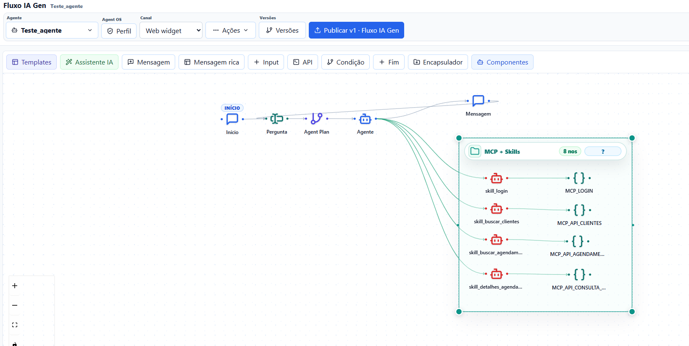
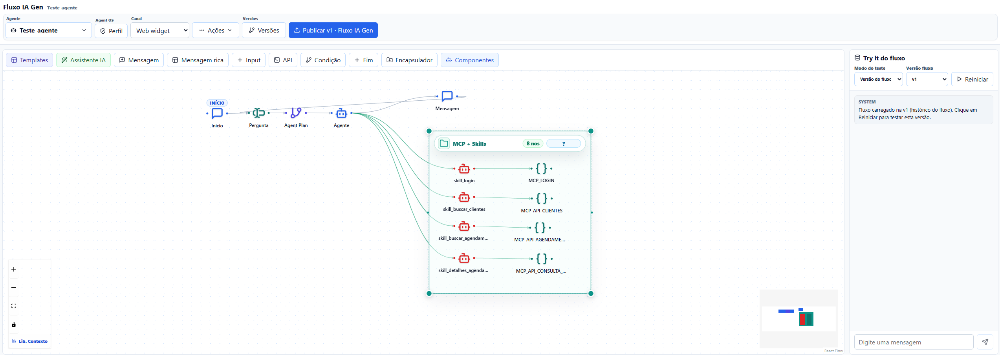
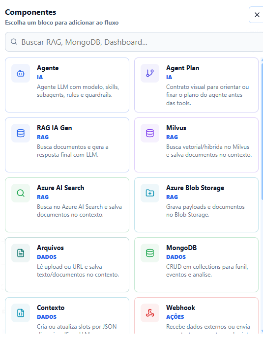
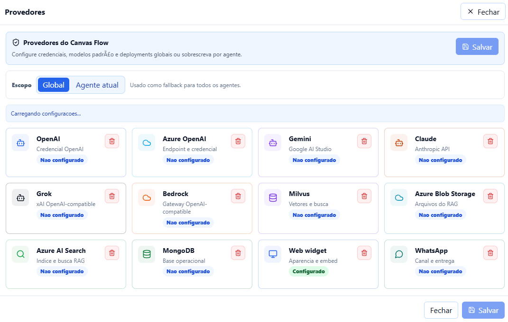

# Canvas Flow

Workspace standalone para a tela Canvas Flow.

Pastas:
- `frontend`: editor visual React Flow desacoplado do frontend atual.
- `backend`: API NestJS no estilo dos projetos `rag_v2` e `orquestrador`.

Escopo implementado:
- Canvas com nodes: mensagem, input, API/httpBatch, condicao, fim e encapsulador.
- Componentes reduzidos: `RAG IA Gen` e `Debug`.
- Backend com CRUD de fluxos.
- RAG com OpenAI embeddings + Milvus/Zilliz.
- Memoria por turnos em Mongo por `agentId + conversationId`.
- Tool `httpBatch` para a IA chamar APIs durante o RAG.
- Teste real do fluxo via `POST /api/canvas-flow/test`.

## Interface

### Editor Visual



### Teste Do Fluxo



### Biblioteca De Componentes



### Provedores



## Rodar local

Suba infraestrutura local se ainda nao tiver Mongo/Milvus:

```bash
docker compose up -d mongo etcd minio milvus
```

Backend:

```bash
cd backend
copy .env.example .env
npm install
npm run start:dev
```

Frontend:

```bash
cd frontend
copy .env.example .env
npm install
npm run dev
```

URLs padrao:
- Frontend: `http://localhost:5177`
- Backend: `http://localhost:3333`
- Swagger: `http://localhost:3333/docs`

## Deploy AWS Lambda

O backend usa Serverless Framework com imagem Docker publicada em ECR.

Arquivos:
- `backend/serverless.yaml`
- `backend/Dockerfile`
- `backend/ymls/custom.yml`
- `backend/ymls/environment.yml`
- `.github/workflows/aws.yml`

Branches do pipeline:
- `main` ou `prd`: stage `prd`
- `homolog` ou `hml`: stage `hml`
- `dev`: stage `dev`

Secrets esperados no GitHub:
- `AWS_ACCESS_KEY_ID`
- `AWS_SECRET_ACCESS_KEY`
- `SERVERLESS_ACCESS_KEY`
- `CANVAS_FLOW_MONGO_DB_CONNECTION_STRING` ou os especificos `*_DEV`, `*_HML`, `*_PRD`
- `CANVAS_FLOW_MILVUS_ADDRESS` ou os especificos por stage
- `CANVAS_FLOW_MILVUS_TOKEN` se usar Zilliz token
- `CANVAS_FLOW_OPENAI_API_KEY` ou os especificos por stage
- opcional: `CANVAS_FLOW_COLLECTION_NAME`

Deploy manual:

```bash
cd backend
npm run build
npm run deploy -- --stage dev --config serverless.yaml
```

Teste local da resolucao do Serverless:

```bash
cd backend
npx serverless@3.38.0 print --stage dev --config serverless.yaml
```

## Observacao

O backend compila sem depender de Mongo/Milvus online, mas para executar precisa de Mongo ativo.
Para RAG real, configure `OPENAI_API_KEY`, `MILVUS_ADDRESS` e `COLLECTION_NAME`.

## Empacotar como npm standalone

A pasta `npm_canvas_flow` cria uma embalagem estilo Node-RED: um pacote com CLI
global que sobe backend e frontend juntos.

Experiencia de usuario final quando publicado no npm:

```bash
npx @igoruehara/canvas-flow@latest --with-docker --open
```

Se o usuario ja tiver MongoDB local rodando:

```bash
npx @igoruehara/canvas-flow@latest --open
```

Desenvolvimento/publicacao local do pacote:

```bash
cd npm_canvas_flow
npm run bundle
npm install -g .
canvas-flow
```

O primeiro start cria `~/.canvas-flow/config.json`. Edite esse arquivo para
trocar Mongo, Milvus, OpenAI, Azure, SQS e demais configs privadas sem mexer nos
`.env` atuais de `frontend` e `backend`.

Comandos uteis para configurar depois da instalacao:

```bash
# Sobe Mongo local via Docker
canvas-flow infra up

# Sobe Mongo + Milvus/MinIO/etcd para RAG local
canvas-flow infra up --full

# Sobe a infra Docker antes de iniciar e abre o navegador
canvas-flow --with-docker --open

# Mostra onde esta o config.json ativo
canvas-flow config

# Abre o config.json no editor padrao
canvas-flow config --edit

# Mostra o JSON no terminal
canvas-flow config --show

# Usa um config.json especifico
canvas-flow --config C:\canvas-flow\config.json

# Valida bundle, config, Mongo e hardening basico antes de publicar
canvas-flow doctor

# Para os containers, mantendo volumes
canvas-flow infra down
```

Observacao: `config.json` contem valores privados, como tokens e secrets
gerados. Use `--show` com cuidado e nao cole esse conteudo em logs publicos.

O pacote npm nao deve ser refeito do zero quando frontend/backend evoluem. Ele e
uma embalagem gerada: rode `npm run bundle` para copiar o `frontend/dist` e o
`backend/dist` atuais para dentro de `npm_canvas_flow`.

Para gerar um tarball local:

```bash
cd npm_canvas_flow
npm run pack:local
npm install -g igoruehara-canvas-flow-0.1.8.tgz
canvas-flow
```

## Producao controlada

Antes de colocar um cliente real, rode os gates de build, testes, audit e
doctor descritos em `docs/PRODUCTION_READINESS.md`.

Arquivos de referencia:
- `backend/.env.production.example`
- `npm_canvas_flow/templates/config.production.example.json`
- `.github/workflows/aws.yml` roda testes e audit antes do deploy backend.
