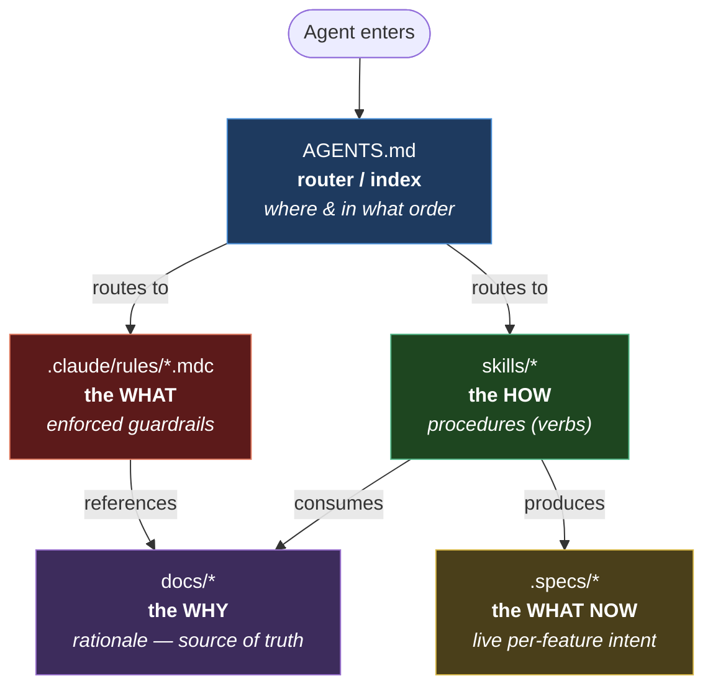

# boilerplate_ai

An **AI-First, Spec-Driven Development (SDD)** starter. It encodes market best practices so an AI agent (and a human) can take a project from a blank repo to verified, traceable code — with research, QA/E2E, and AI-evaluation baked in from day one.

## Philosophy

> The complexity lives in the system, not in your head. You describe intent; the workflow decides how much rigor to apply.

Three layers, each with one job:

| Layer | Job | Lives in |
|---|---|---|
| **Orchestrator** | Tells agents where everything is and the order to apply it | [AGENTS.md](AGENTS.md) |
| **Knowledge** | The *why* — architecture, patterns, product, AI plan | [docs/](docs/) |
| **Rules** | The *what* (enforced, machine-readable) | [.claude/rules/](.claude/rules/) |

Skills are the *how* — executable procedures: [.claude/skills/](.claude/skills/).

## Architecture of context

An agent has finite context and zero memory between sessions. Putting everything in one file breaks on
three fronts: **cost** (load 50k tokens for a 1-line fix), **drift** (the same rule written twice diverges),
and **non-determinism** (a rule buried in a huge doc gets forgotten). The fix is the market-converging
pattern: **separate by function, route on demand.** Each layer has exactly one job, and upper layers
**point** — they never copy.



| Layer | Answers | Nature | Code analogy |
|---|---|---|---|
| `AGENTS.md` | *Where is what, in what order?* | thin index / router | the README + table of contents |
| `skills/` | *How do I execute X?* | procedure (verb) | a function / playbook |
| `rules/*.mdc` | *What must always be true?* | enforced constraint, short | the tests / linter |
| `docs/` | *Why is it this way?* | rationale, source of truth | architecture documentation |
| `.specs/` | *What do I build now?* | live per-feature intent | the open ticket |

**Why the arrows point one way.** `rules → docs` (never the reverse): a `.mdc` states the enforced rule in
two lines and **links** the doc that explains the *why*. The rule stays short (always fits context); the
rationale lives in exactly one place (no drift). `skills` consume docs + rules rather than duplicating them.
`docs` are leaves — the single source of truth. It is the same one-directional dependency rule that
[`architecture.mdc`](.claude/rules/architecture.mdc) enforces on the code: no cycles, no duplication.

**How routing runs (progressive disclosure).** The agent loads the minimum, then expands by following pointers:

```
1. Read AGENTS.md        (cheap, ~1 page)        → "new project? run discovery"
2. Load the right skill  (discovery/SKILL.md)    → the procedure
3. Skill points to docs  (vision, overview…)     → only what that phase needs
4. Relevant .mdc rules engage via their glob     → guardrail active on the file being edited
```

This keeps the agent inside its token budget (the SDD engine targets <40k loaded) without losing rigor.

> **One line:** docs = *why* · rules = *what* (enforced) · skills = *how* · AGENTS.md = *where/when* · specs = *what now*. Upper layers point; they never copy.

## Bootstrapping a new project (the order)

```
0. Discovery   → interview + generate the foundational docs   (.claude/skills/discovery)
1. Specify     → requirements with traceable IDs              (tlc-spec-driven)
2. Design      → architecture & components (when needed)      (tlc-spec-driven + research skill)
3. Tasks       → atomic, verifiable breakdown                 (tlc-spec-driven)
4. Execute     → implement → verify → atomic commit           (tlc-spec-driven)
5. QA / E2E    → Playwright smoke + critical-path coverage    (qa-e2e skill + qa/e2e)
```

Discovery runs **before** anything else — it asks the questions that prevent garbage docs, then writes `docs/` and seeds `.specs/`. See [docs/workflows/00-discovery.md](docs/workflows/00-discovery.md).

## Directory layout

```
boilerplate_ai/
├── AGENTS.md                     # orchestrator — read first
├── README.md                     # this file
├── .claude/
│   ├── rules/                    # *.mdc — enforced guardrails referencing docs
│   └── skills/
│       ├── tlc-spec-driven/      # the SDD engine (vendored) — Specify→Design→Tasks→Execute
│       ├── discovery/            # the "prior" intake skill (interview → docs) — runs BEFORE tlc
│       ├── research/             # knowledge verification & spike research — called BY tlc/discovery
│       └── qa-e2e/               # Playwright / E2E strategy — runs AFTER tlc Execute
├── docs/
│   ├── architecture/             # overview, patterns, tech-stack, ADRs
│   ├── ai/                       # AI integration plan + evaluation strategy
│   ├── product/                  # vision + roadmap
│   └── workflows/                # playbooks: discovery, SDD loop, research, QA, release, AI eval-run
└── qa/
    └── e2e/                      # Playwright config + tests
```

## How to use it in a real repo

1. Copy `boilerplate_ai/*` to your new project root (or use it as a template repo). **All four skills, including the SDD engine, come included** — no extra install needed.
2. Run the **Discovery** skill — answer the interview.
3. From then on, drive features with `tlc-spec-driven`.

## Included skills (vendored)

All live in [.claude/skills/](.claude/skills/) and work the moment the folder is at the repo root:

- **`tlc-spec-driven`** — the SDD engine (Specify → Design → Tasks → Execute). The center of the skill layer; the others orbit its lifecycle. _Vendored from the [Tech Lead's Club](https://github.com/tech-leads-club) (Felipe Rodrigues), CC-BY-4.0 — see the skill's own `README.md` for attribution._
- **`discovery`** — runs first; interviews then writes the foundation docs.
- **`research`** — knowledge verification; called by discovery/tlc for unknowns.
- **`qa-e2e`** — Playwright E2E for critical journeys; runs after Execute.

> Vendored = version-frozen and offline-ready. To pull a newer release, re-run
> `npx @tech-leads-club/agent-skills install -s tlc-spec-driven` and copy it back into `.claude/skills/`.

## External dependencies

- `playwright` (dev dependency) for the QA/E2E layer: `npm i -D @playwright/test && npx playwright install`
- Optional: `mermaid-studio` (diagram rendering), `codenavi` (code exploration)
