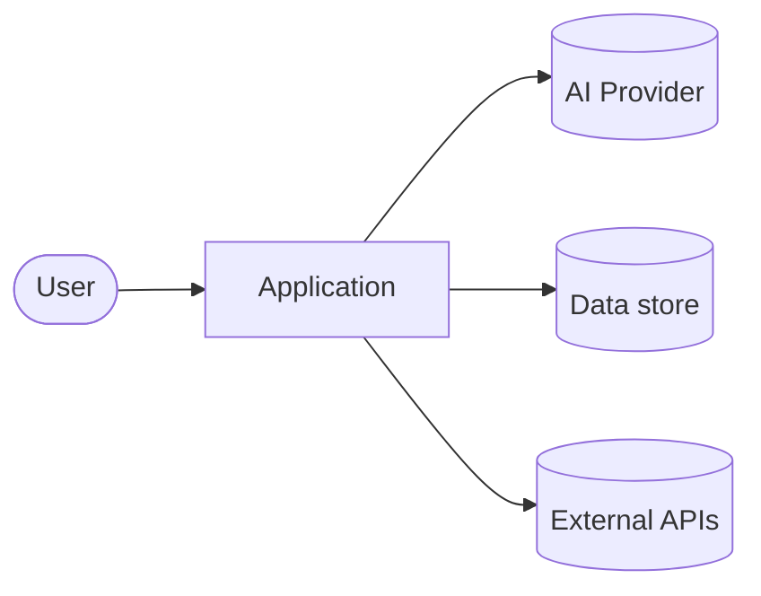

# Architecture Overview

> The boundaries an agent must not cross. The enforced version lives in
> [.claude/rules/architecture.mdc](../../.claude/rules/architecture.mdc); this file is the rationale.

## 1. Context (C4 level 1)

<!-- Discovery fills this. One diagram + one paragraph. -->


_What the system does, who uses it, what it depends on._

## 2. Layers & dependency rule

Dependencies point **inward only**. Outer layers may depend on inner; never the reverse.

```
ui / delivery      →  application (use-cases)  →  domain (core)  ←  infrastructure (adapters)
```

| Layer | Responsibility | May import | Must NOT import |
|---|---|---|---|
| `domain` | Business rules, entities, pure logic | nothing (framework-free) | ui, infra, application |
| `application` | Use-cases, orchestration, ports | domain | ui, concrete infra |
| `infrastructure` | DB, HTTP, AI SDKs, file system (adapters) | domain, application ports | ui |
| `ui` / `delivery` | Routes, components, CLI, controllers | application | domain internals, infra directly |

**Why:** the core stays testable and provider-agnostic. Swapping an AI provider, a DB, or a UI framework is an adapter change — not a rewrite.

## 3. AI as a port (AI-First)

AI is **never** called directly from `ui` or `domain`. It is a **port** in `application` with adapters in `infrastructure`:

```
application/ports/ai-provider.ts        (interface — what we need)
infrastructure/ai/anthropic.adapter.ts  (implementation — Claude)
infrastructure/ai/<other>.adapter.ts    (swappable)
```

This keeps prompts, models, and provider choice out of business logic and makes [evaluations](../ai/evaluations.md) possible. See [docs/ai/integration-plan.md](../ai/integration-plan.md).

## 4. Cross-cutting concerns

- **Config & secrets:** environment-injected, never hardcoded. AI keys live behind the AI adapter only.
- **Errors:** domain raises typed errors; adapters translate transport errors into domain errors.
- **Observability:** log at boundaries (use-case entry/exit, adapter calls). AI calls log model, tokens, latency.
- **Testing seams:** every port has a fake/in-memory implementation for fast tests.

## 5. Source of truth

When this doc and the code disagree, **open an ADR** ([decisions/](decisions/)) to reconcile — don't silently drift.
